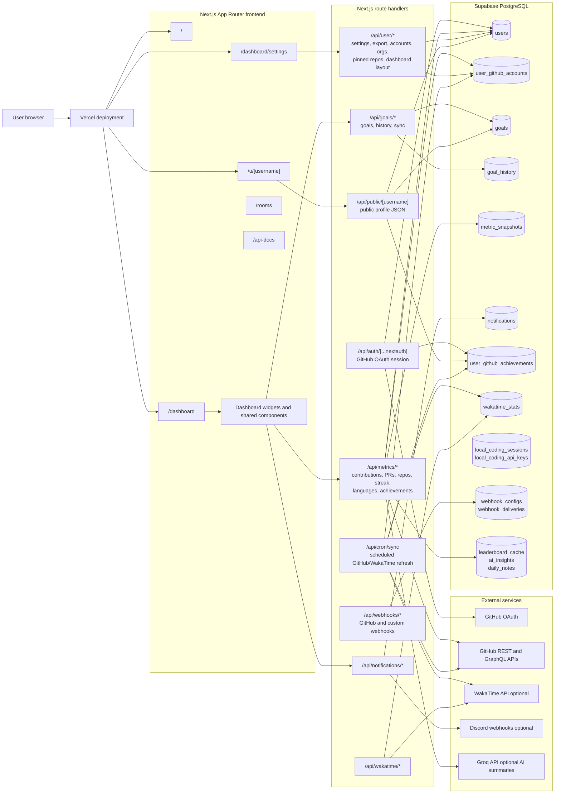
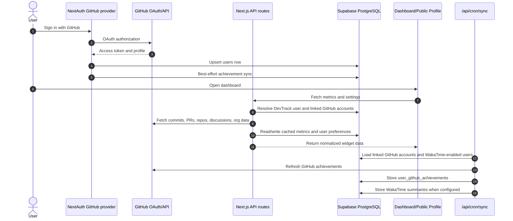
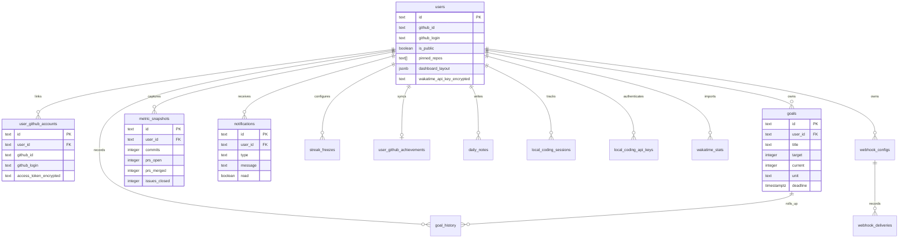

# DevTrack Architecture

This page gives new contributors a map of how DevTrack's pages, API routes,
database tables, and external services work together.

## System Overview

## GitHub Activity Sync Flow

## Frontend

DevTrack uses the Next.js App Router under `src/app`.

| Area | Files | Purpose |
|---|---|---|
| Landing | `src/app/page.tsx`, `src/components/landing/LandingPage.tsx` | Public marketing and product entry point |
| Auth | `src/app/auth/signin/page.tsx`, `src/app/auth/layout.tsx` | GitHub sign-in UI |
| Dashboard | `src/app/dashboard/page.tsx`, `src/app/dashboard/layout.tsx` | Authenticated developer dashboard |
| Settings | `src/app/dashboard/settings/page.tsx` | Public profile, WakaTime, Discord, pinned repo, and privacy settings |
| Public profile | `src/app/u/[username]/page.tsx` | Shareable profile backed by `/api/public/[username]` |
| Repo views | `src/app/dashboard/repo-health/page.tsx`, `src/app/dashboard/repo-comparison/page.tsx` | Repository analysis experiences |
| Community | `src/app/leaderboard/page.tsx`, `src/app/rooms/*` | Public leaderboard and rooms |

The dashboard is composed from reusable widgets in `src/components`, especially
`src/components/dashboard/CustomizableDashboard.tsx`. Widgets call focused API
routes rather than sharing a large client-side data store.

## API Routes

Route handlers live in `src/app/api`.

| Route group | Responsibility |
|---|---|
| `/api/auth/[...nextauth]` | GitHub OAuth through NextAuth, JWT session creation, user upsert, token validation |
| `/api/auth/link-github` | Link additional GitHub accounts for multi-account metrics |
| `/api/metrics/*` | GitHub-derived dashboard metrics such as contributions, PRs, repos, issues, languages, streaks, achievements, CI, repo health, and comparisons |
| `/api/goals/*` | Goal CRUD, goal history, and GitHub-backed goal progress sync |
| `/api/user/*` | Settings, linked accounts, pinned repos, organizations, dashboard layout, data export |
| `/api/notifications/*` | Notification reads, marking read, weekly notifications, Discord sync |
| `/api/public/[username]` | Public profile payload with rate limiting and visibility checks |
| `/api/cron/sync` | Scheduled refresh for WakaTime summaries and GitHub achievements |
| `/api/wakatime/*` | Optional WakaTime connection and sync endpoints |
| `/api/webhooks/*` | GitHub webhook receiver plus user-configured custom webhooks |
| `/api/local-coding/*` | Local coding session API keys, stats, and sync |

Most authenticated routes read the NextAuth session with `getServerSession`,
resolve the DevTrack user via `src/lib/resolve-user.ts`, then use the
server-side Supabase admin client from `src/lib/supabase.ts`.

## Database

Supabase PostgreSQL is the primary datastore. The current codebase does not use
Prisma; the canonical schema and migrations live in `supabase/schema.sql` and
`supabase/migrations`.

The diagram is intentionally simplified. Tables for rooms, repository health,
leaderboard cache, AI insights, Jira credentials, public widgets, and data
exports are included in migrations but omitted above to keep the onboarding
view readable.

## External Services

| Service | Used by | Notes |
|---|---|---|
| GitHub OAuth | NextAuth provider in `src/lib/auth.ts` | Primary sign-in and access-token source |
| GitHub REST/GraphQL APIs | `src/lib/github*.ts`, `/api/metrics/*`, `/api/cron/sync` | Fetches commits, PRs, repos, achievements, discussions, orgs, and profile data |
| Vercel | App hosting | Runs the Next.js frontend and route handlers |
| Supabase | Database and RLS | Stores users, preferences, linked accounts, goals, notifications, and cached data |
| WakaTime | `/api/wakatime/*`, `/api/cron/sync` | Optional coding-time import when a user stores an encrypted API key |
| Discord | Notification settings | Optional webhook delivery for reminders and alerts |
| Groq | AI routes/widgets | Optional AI summaries and mentor-style insights |

## Operational Notes

- GitHub OAuth tokens are held in the NextAuth JWT session. Additional linked
  account tokens are encrypted before storage in `user_github_accounts`.
- Public profile responses are gated by `users.is_public` and rate limited in
  `/api/public/[username]`.
- Metrics routes use caching helpers from `src/lib/metrics-cache.ts` to reduce
  GitHub API pressure.
- Scheduled sync work is exposed through `/api/cron/sync` and protected by
  `CRON_SECRET` outside development.
- Server-only Supabase access should go through `supabaseAdmin`; browser code
  should use public/anon-safe clients only.
